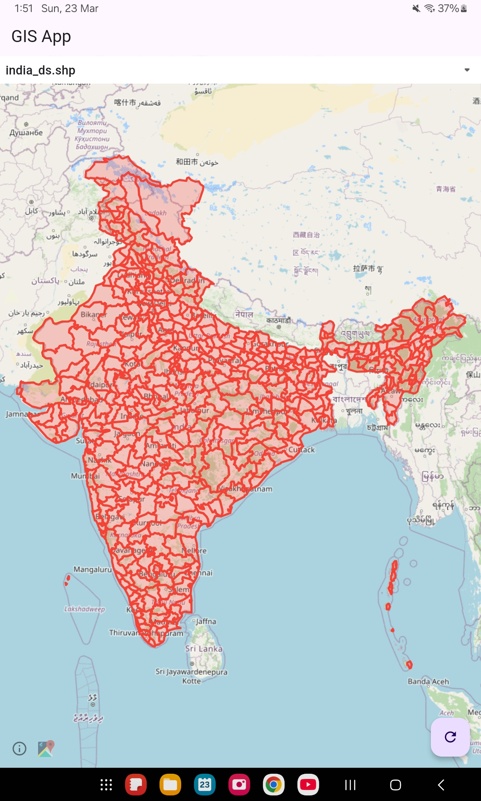
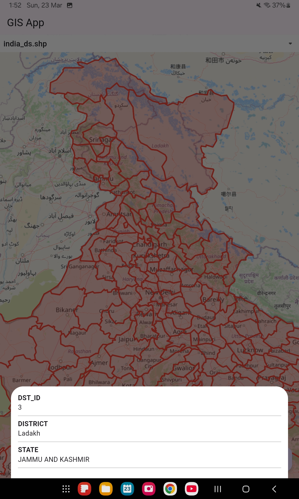
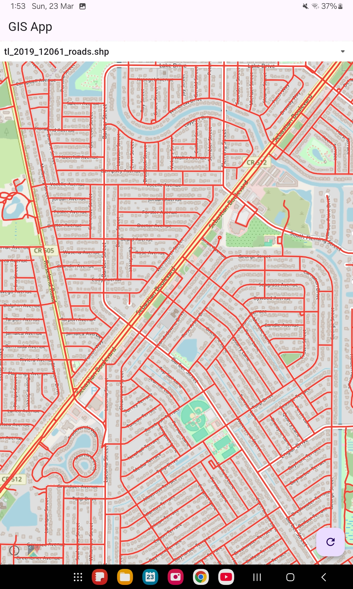
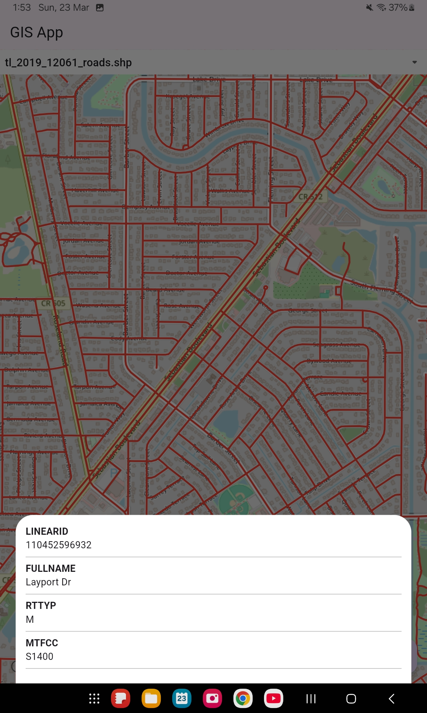

# **Flutter ShapeFile Plotter**  
A Flutter app that reads and plots `shapefiles` on a map using the `flutter_map` package.  

## **Overview**  
This project parses binary shapefiles (`.shp` and `.dbf`) and converts them into a format compatible with `flutter_map`, enabling dynamic visualization of geographic data.  

## **Features**  
- Users can select a `.shp` file, and the corresponding `.dbf` file is automatically loaded.  
- Displays geographic features with attributes (visible on click).  
- Converts shapefile data into a renderable format.

## Working Images

## **Future Scope**  
- Develop a Dart package to convert shapefiles to GeoJSON or other formats.  
- Provide an efficient API for handling shapefiles in Flutter apps.  
- Enhance compatibility with multiple map-rendering libraries.  
