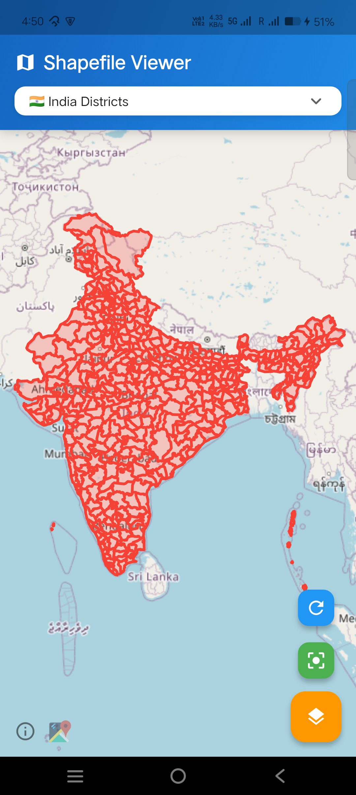
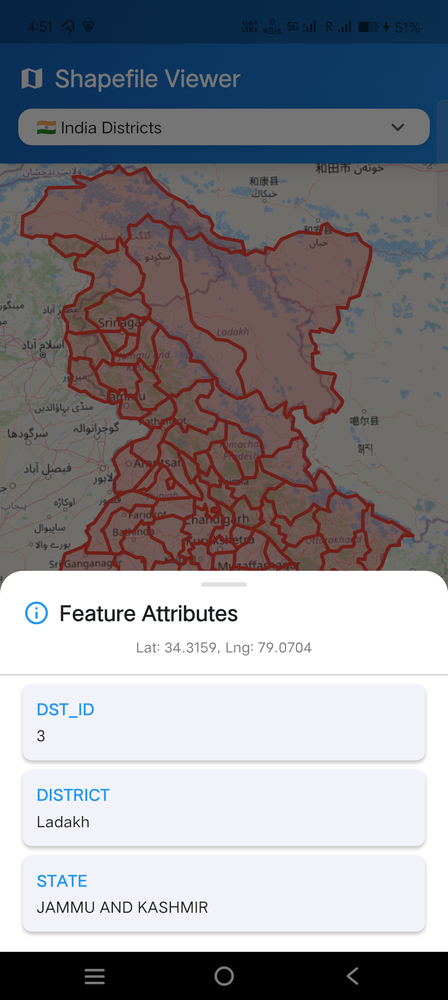
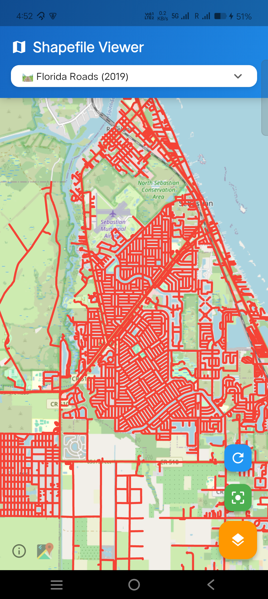
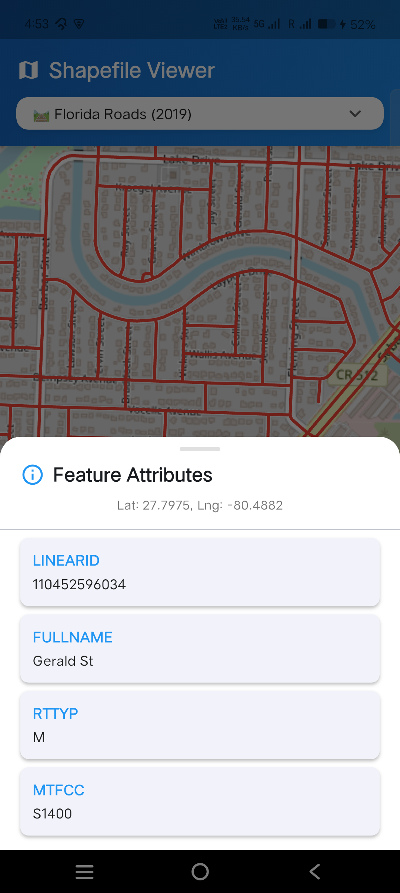

# 🗺️ **Flutter Shapefile Viewer**  

[](https://flutter.dev)
[](https://dart.dev)
[](https://opensource.org/licenses/MIT)

A powerful and intuitive Flutter application that reads, parses, and visualizes ESRI Shapefiles (.shp) on an interactive map using the `flutter_map` package.

## ✨ **Key Features**  

### 🎯 **Core Functionality**
- **📁 Dynamic File Selection**: Choose from multiple shapefiles via an elegant dropdown menu
- **🗺️ Interactive Mapping**: Built on OpenStreetMap with full pan, zoom, and tap capabilities  
- **📊 Attribute Display**: Click any feature to view its complete attribute data in a beautiful modal
- **🎨 Smart Rendering**: Automatically handles both polygon and polyline geometries with optimized rendering

### 🚀 **Enhanced User Experience**
- **💫 Smooth Animations**: Fade transitions and haptic feedback for premium feel
- **📱 Responsive Design**: Adaptive UI that works on phones and tablets
- **⚡ Real-time Loading**: Progress indicators and status feedback
- **🎛️ Multi-layer Controls**: Floating action buttons for map operations
- **📍 Auto-fitting**: Automatically centers and zooms to shapefile bounds

### 🔧 **Technical Excellence**
- **🏗️ Clean Architecture**: Well-structured codebase with separation of concerns
- **🛡️ Error Handling**: Robust error management with user-friendly messages
- **📦 Asset Management**: Efficient loading of embedded shapefile assets
- **🎨 Material Design**: Follows Flutter's Material Design principles

## 🛠️ **Installation & Setup**

### Prerequisites
- Flutter SDK 3.5.4 or higher
- Dart SDK compatible with Flutter version
- Android Studio / VS Code with Flutter extensions

### Clone & Run
```bash
# Clone the repository
git clone https://github.com/vk7061iitb/flutter_shp.git
cd flutter_shp

# Install dependencies
flutter pub get

# Run the app
flutter run
```

## 📚 **Supported Shapefiles**

The app comes pre-loaded with diverse datasets for testing:

| Dataset | Description | Region | Type |
|---------|-------------|---------|------|
| 🇮🇳 India Districts | Administrative boundaries | India | Polygons |
| 🇺🇸 US States | State boundaries | United States | Polygons |
| 🇺🇸 US American Indian Areas | Tribal territories | United States | Polygons |
| 🌍 World States & Provinces | Global administrative areas | Worldwide | Polygons |
| 🛣️ Wisconsin Primary Roads | Major highways | Wisconsin, US | Polylines |
| 🛤️ Florida Roads (2019) | Road network | Florida, US | Polylines |
| 💧 Arizona Water Areas | Lakes and rivers | Arizona, US | Polygons |

## 🎮 **How to Use**

1. **📱 Launch the App**: Open the Flutter Shapefile Viewer
2. **📂 Select Dataset**: Use the dropdown menu to choose your desired shapefile
3. **🗺️ Explore the Map**: 
   - **Pan**: Drag to move around
   - **Zoom**: Pinch or use mouse wheel
   - **Tap Features**: Click on any polygon/polyline to see attributes
4. **🎛️ Use Controls**:
   - **🔄 Refresh**: Reload current dataset
   - **🎯 Center**: Fit map to shapefile bounds  
   - **📊 Info**: View layer statistics

## 🏗️ **Project Structure**

```
lib/
├── main.dart                 # App entry point & theme setup
├── ui/
│   └── map_page.dart        # Enhanced map interface with controls
├── utils/
│   ├── data.dart           # Shapefile data models
│   ├── dbf_reader.dart     # DBF attribute file parser
│   └── load.dart           # Shapefile loading utilities
├── models/
│   └── shp_data.dart       # Data structure definitions
└── assets/
    └── shapefiles/         # Embedded shapefile datasets
```

## 📦 **Dependencies**

### Core Packages
- **`flutter_map`** (^7.0.2): Interactive map widget
- **`latlong2`** (^0.9.1): Latitude/longitude calculations
- **`logger`** (^2.5.0): Enhanced logging capabilities

### Development Tools  
- **`flutter_lints`** (^4.0.0): Code quality enforcement
- **`flutter_test`**: Unit and widget testing framework

## 🖼️ **Screenshots & Demo**

### 📱 **India Districts View**

*Interactive view of Indian administrative districts with smooth rendering*

### 📊 **Attribute Inspector** 

*Detailed feature attributes displayed in an elegant modal interface*

### 🛣️ **Road Networks**

*Complex polyline rendering of transportation infrastructure*

### 🔍 **Road Details**

*Comprehensive road feature information with coordinate display*

## 🚀 **Future Roadmap**

### 📦 **Package Development**
- [ ] **Dart Package**: Create standalone shapefile parser for pub.dev
- [ ] **GeoJSON Export**: Convert shapefiles to web-standard GeoJSON format
- [ ] **Multiple Formats**: Support for KML, GPX, and other GIS formats

### 🎨 **UI/UX Enhancements**
- [ ] **Custom Styling**: User-configurable color schemes and symbology
- [ ] **Layer Management**: Toggle visibility of multiple simultaneous layers
- [ ] **Search & Filter**: Find features by attribute values
- [ ] **Measurement Tools**: Distance and area calculation tools

### ⚡ **Performance & Scalability**
- [ ] **Streaming**: Support for large shapefiles with progressive loading
- [ ] **Caching**: Intelligent caching for frequently accessed datasets
- [ ] **Background Processing**: Non-blocking file operations
- [ ] **Memory Optimization**: Efficient handling of massive datasets


## 🤝 **Contributing**

We welcome contributions! Here's how you can help:

1. **🍴 Fork the Repository**
2. **🌿 Create Feature Branch**: `git checkout -b feature/amazing-feature`
3. **💻 Make Changes**: Implement your improvements
4. **✅ Test Thoroughly**: Ensure all tests pass
5. **📝 Commit Changes**: `git commit -m 'Add amazing feature'`
6. **🚀 Push Branch**: `git push origin feature/amazing-feature`
7. **🔄 Open Pull Request**: Submit for review

### 🧪 **Development Guidelines**
- Follow Flutter/Dart style guidelines
- Write tests for new features
- Update documentation as needed
- Ensure backward compatibility

## 📄 **License**

This project is licensed under the MIT License - see the [LICENSE](LICENSE) file for details.

## 🙏 **Acknowledgments**

- **OpenStreetMap Contributors** for providing base map tiles
- **Flutter Team** for the amazing framework
- **ESRI** for the Shapefile format specification
- **GIS Community** for continuous innovation in geospatial technology

---

⭐ **Star this repository if you find it useful!** ⭐
